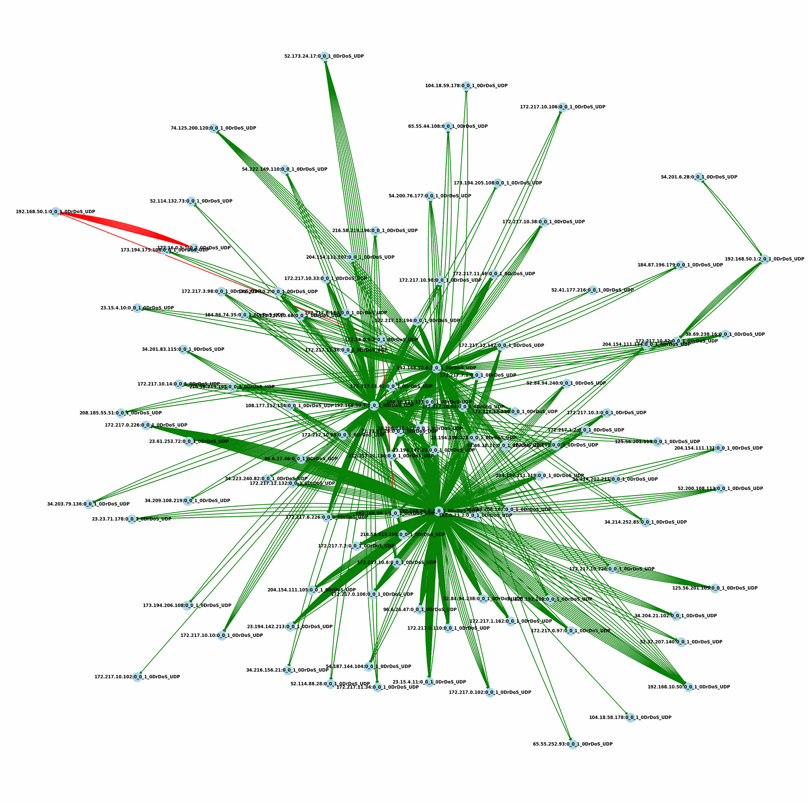
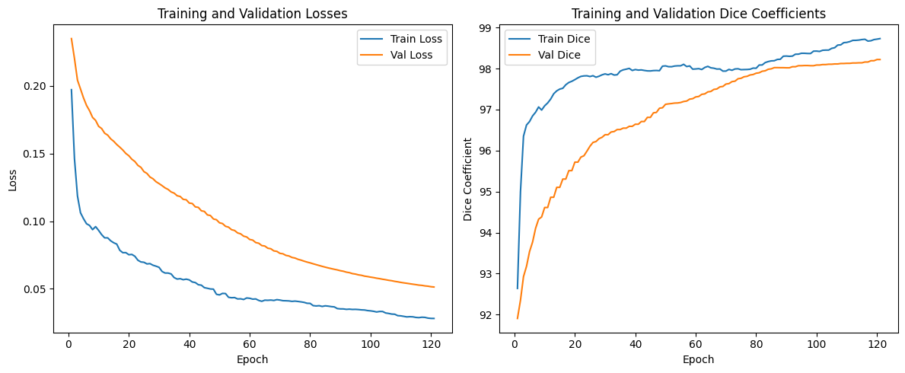
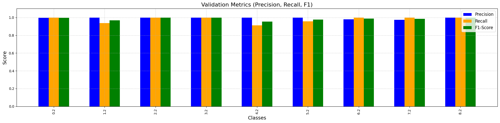
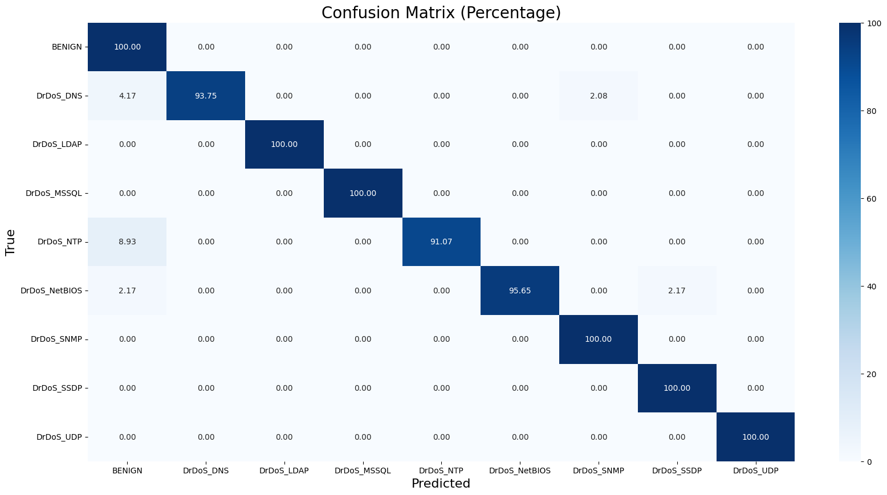
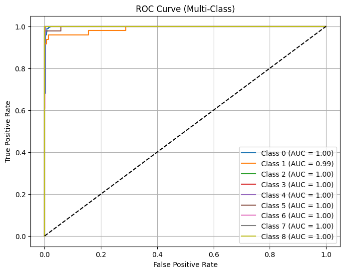

# GNN-based Network Intrusion Detection: Open Source Implementation

This repository contains the complete open-source implementation of a graph neural network (GNN) model for network intrusion detection.  
The codebase corresponds to the research methodology and experiments presented in the associated scientific article on leveraging graph deep learning for robust and accurate detection of network attacks.

## Overview

Network security remains a critical challenge, and intrusion detection systems (IDS) play a vital role in identifying malicious activity.  
Unlike traditional methods relying solely on tabular or sequential data, this project exploits the structural relationships inherent in network traffic by representing data as graphs and applying Graph Neural Networks (GNNs) to capture complex patterns.

This repository provides a comprehensive pipeline that includes:

- **Data Preprocessing and Graph Construction:**  
  Loading raw network flow data, feature cleaning and normalization, constructing graph representations with nodes (entities such as clients/servers) and edges (network connections), and handling class imbalance via graph-based balancing techniques.

  

- **Graph Feature Engineering:**  
  Calculating node and edge embeddings that capture essential semantic and behavioral characteristics of network traffic.

- **Model Definition:**  
  Implementing state-of-the-art GNN architectures to process graph-structured data, including customized node and edge processing layers.

- **Training and Evaluation:**  
  Training the GNN on labeled network traffic data, validating via standard metrics, and finally evaluating on test sets to assess detection performance.

  

- **Results Visualization:**  
  Providing tools for visual analysis of model predictions, including confusion matrices, precision/recall/F1 scores, and multi-class ROC curves to understand classification effectiveness.

  ### Precision, Recall, and F1-Score  
    

  ### Confusion Matrix  
  

  ### ROC Curve 
   

## Key Features

- Uses PyTorch and PyTorch Geometric libraries for efficient graph deep learning  
- Modular code with well-documented functions covering all steps from data ingestion to model output  
- Implements focal loss function to handle class imbalance common in intrusion datasets  
- Supports flexible graph balancing and splitting strategies for robust training  
- Visualization scripts aid in diagnostic analysis of model behavior  

## Getting Started

### Requirements
- Python 3.8+  
- PyTorch  
- PyTorch Geometric  
- Scikit-learn  
- Pandas, NumPy, NetworkX, Matplotlib, Seaborn  

### Usage

1. Prepare raw network data in specified CSV format.  
2. Execute the data preprocessing and graph construction pipeline.  
3. Train the GNN model using the provided training loops.  
4. Evaluate and visualize the results through built-in functions.

## Contribution

This repository is open for contributions, improvements, and discussions. We welcome collaborators interested in enhancing network security through graph deep learning.

## Citation

If you use this code in your research, please cite the corresponding article:  
*(Provide citation details here)*

---

For detailed guidance on each step and customization options, please refer to the code comments and notebook markdown cells.

---

*This project is released under the MIT License.*
